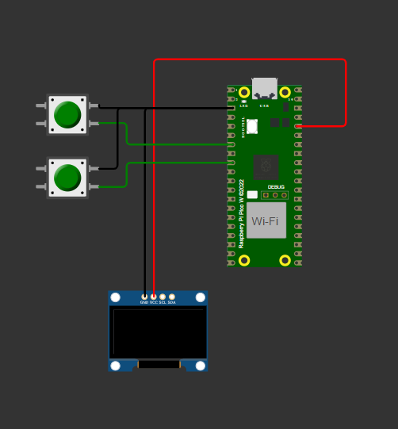

= Conectando um display OLED via I2C

Este código de exemplo mostra como interfacear o Raspberry Pi Pico com uma placa de display OLED 128x32 baseada no controlador de display SSD1306, cujo datasheet pode ser encontrado https://cdn-shop.adafruit.com/datasheets/SSD1306.pdf[aqui].

O código exibe uma série de gráficos de demonstração; pequenas framboesas que rolam horizontalmente, algum texto e alguns desenhos de linhas, mostrando como inicializar o display, escrever em todo o display, escrever apenas em uma parte do display, configurar a rolagem, inverter o display, etc.

O SSD1306 é operado por meio de uma lista de comandos versáteis (consulte o datasheet) que permitem ao usuário acessar todas as capacidades do controlador. Após enviar um endereço de escravo, os dados que seguem podem ser um comando, flags para acompanhar um comando ou dados a serem escritos diretamente na RAM do display. Um byte de controle é necessário para cada escrita após o endereço do escravo, para que o controlador saiba que tipo de dado está sendo enviado.

O código de exemplo suporta displays de 32 ou 64 pixels de altura por 128 pixels de largura, alterando uma definição no topo do código.

No caso de 32 pixels verticais, o display é dividido em 4 páginas, cada uma com 8 pixels de altura. Na RAM, isso se parece aproximadamente com:

----
           | COL0 | COL1 | COL2 | COL3 |  ...  | COL126 | COL127 |
    PAGE 0 |      |      |      |      |       |        |        |
    PAGE 1 |      |      |      |      |       |        |        |
    PAGE 2 |      |      |      |      |       |        |        |
    PAGE 3 |      |      |      |      |       |        |        |
    --------------------------------------------------------------
----

Dentro de cada página, temos:

----
          | COL0 | COL1 | COL2 | COL3 |  ...  | COL126 | COL127 |
    COM 0 |      |      |      |      |       |        |        |   
    COM 1 |      |      |      |      |       |        |        |   
       :  |      |      |      |      |       |        |        |  
    COM 7 |      |      |      |      |       |        |        |
    -------------------------------------------------------------
----

[NOTA]
Há uma diferença entre as colunas na RAM e os pinos de segmento reais que conectam o controlador ao display. Os endereços de RAM COL0 - COL127 são mapeados para esses pinos de segmento SEG0 - SEG127 por padrão. A distinção entre esses dois é importante, pois podemos, por exemplo, espelhar facilmente o conteúdo da RAM sem reescrever um buffer.
O controlador possui 3 modos de transferência dos pixels na RAM para o display (desde que o controlador esteja configurado para usar o conteúdo de sua RAM para acionar o display, ou seja, o comando 0xA4 seja enviado). Escolhemos o modo de endereçamento horizontal que, após definir os registros de endereço de coluna e página para as posições iniciais desejadas, incrementará o registro de endereço de coluna até que a largura do display OLED seja atingida (127 no nosso caso), após o qual o registro de endereço de coluna será reiniciado para seu valor inicial e o endereço da página será incrementado. Uma vez que o registro de página chega ao final, ele também será reiniciado. Efetivamente, isso varre o display de cima para baixo, da esquerda para a direita, em blocos de 8 pixels de altura. Quando um byte é enviado para ser escrito na RAM, ele define todas as linhas para a posição atual do registro de endereço de coluna. Então, se enviarmos 10101010 e estivermos na PÁGINA 0 e COL1, COM0 será definido como 1, COM1 como 0, COM2 como 1 e assim por diante. Efetivamente, o byte é "transposto" para preencher uma coluna de uma única página. O datasheet contém mais informações sobre este e os outros dois modos.

O modo de endereçamento horizontal tem a vantagem de podermos manter um único buffer de 512 bytes (128 colunas x 4 páginas e cada byte preenche as linhas de uma página) e escrevê-lo de uma vez na RAM (o endereço de coluna incrementa automaticamente em escritas e leituras) em vez de trabalhar com matrizes 2D de pixels e adicionar mais sobrecarga.
[[ssd1306_i2c_wiring]]
[pdfwidth=75%]
.Diagrama de conexão para o display OLED via I2C.

== Lista de Arquivos

CMakeLists.txt:: Arquivo CMake para incorporar o exemplo na árvore de construção de exemplos.
ssd1306_i2c.c:: O código de exemplo.
ssd1306_font.h:: Uma fonte simples usada no exemplo.
img_to_array.py:: Um auxiliar para converter um arquivo de imagem em um array que pode ser usado no exemplo.
raspberry26x32.bmp:: Arquivo de imagem de exemplo de uma framboesa.
raspberry26x32.h:: O arquivo de imagem de exemplo convertido em um array C.

== Lista de Materiais

.Uma lista de materiais necessários para o exemplo
[[ssd1306_i2c-bom-table]]
[cols=3]
|===
| Item | Quantidade | Detalhes
| Breadboard | 1 | peça genérica
| Raspberry Pi Pico | 1 | https://www.raspberrypi.com/products/raspberry-pi-pico/
| Display OLED baseado em SSD1306 | 1 | https://www.adafruit.com/product/4440[Peça da Adafruit]
| push button | 2 | peça genérica
| Jumpers M/M | 4 | peça genérica
|===
